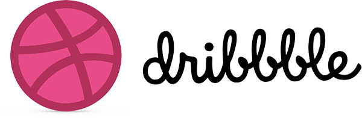

# 🏀 Dribble Clone - Creative Platform  

✨ A beautifully crafted **Dribble clone**, showcasing top designers with smooth animations, built using **HTML & CSS **.  

---

## 🔖 Badges  

  
  
  
  
  
  

---

## 📸 Preview  

  

---

## 🚀 Live Demo  

Check out the live demo of this project here:  
[Demo Link](https://ayush-raghuwanshi-dev.github.io/Recreate-Dribble/) 

---

## 🚀 Key Features  

✅ **Fully responsive** design for all screen sizes  
🎨 **Interactive talent showcase** with hover effects  
⭐ **Smooth animations** for modern UI transitions  
🔍 **Search functionality** to discover top creatives  
📱 **Optimized for mobile** with touch-friendly interactions  

---

## 🛠️ Tech Stack  

  
  
  
  

---

## 📱 Responsive Design  

This page is built with **mobile-first principles** and is optimized for all screen sizes:  
📱 **Mobile**, 💻 **Tablet**, 🖥️ **Desktop**  

---

## 👨‍💻 Author  

**Ayush Raghuwanshi**  
📍 *B.Tech CSE Student | Passionate Frontend Developer*  
🔗 GitHub: [@Ayush-Raghuwanshi-Dev](https://github.com/Ayush-Raghuwanshi-Dev)  

---

## 📄 License  

This project is licensed under the [MIT License](LICENSE).  

  

---

💖 Crafted with passion | 🚀 Star this repo if you like it!

